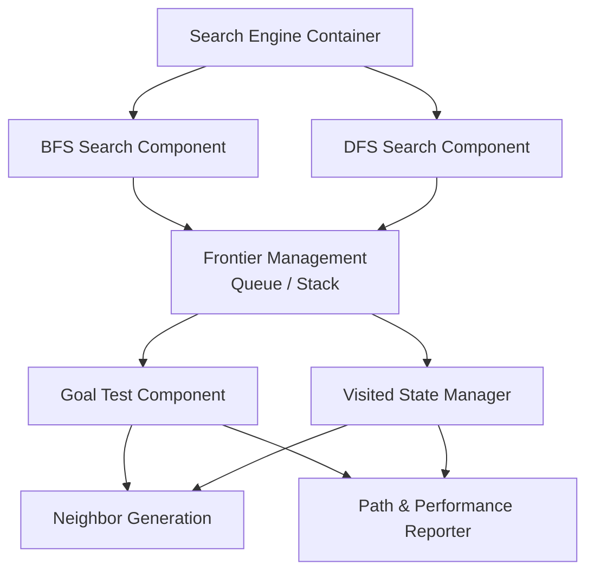

# C4 Level 3 – Component Diagram

**Selected Container: Search Engine**

## Explanation
The **Search Engine** container breaks down into five specialized internal components that handle execution:
* **BFS & DFS Search Components:** Separate traversal modules that process states using different exploration strategies—BFS traverses breadth-first level by level, while DFS prioritizes deep branching down to a specified cutoff limit[cite: 9].
* **Frontier Management:** Coordinates unvisited states waiting to be explored using a double-ended queue (`collections.deque`) for BFS and an execution stack list for DFS[cite: 9].
* **Goal Test Component:** Evaluates newly extracted candidate board layouts directly against the target goal configuration `(1, 2, 3, 4, 5, 6, 7, 8, 0)`[cite: 9].
* **Visited State Manager:** Maintains an in-memory hash set/dictionary of previously seen board states to prune cycles and avoid infinite graph traversals[cite: 9].
* **Neighbor Generation & Performance Reporter:** Generates valid sliding-tile transitions via row/column checks, tracking expanded node counts, path depth, and latency metrics upon completing the search[cite: 9].
