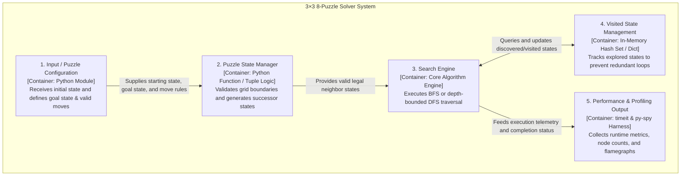

## C4 Level 2: Container Diagram

### Container Diagram Explanation
* **1. Input / Puzzle Configuration Container:** Acts as the entry configuration layer that ingests the start layout, holds the immutable target goal state `(1, 2, 3, 4, 5, 6, 7, 8, 0)`, and defines legal directional offsets for the empty tile `0`.
* **2. Puzzle State Manager Container:** Responsible for translating the flat 9-element tuple into a 2D coordinate space via `divmod`, calculating row/column index boundaries, and generating all valid adjacent board permutations.
* **3. Search Engine Container:** The core computation engine responsible for frontier orchestration. It handles tree/graph expansion using FIFO queue management for Breadth-First Search and LIFO stack management with depth bounding for Depth-First Search.
* **4. Visited State Management Container:** An in-memory closed-set container utilizing Python set and dictionary hashing. It prevents state-space cycles and infinite path traps by checking if a candidate layout was already explored.
* **5. Performance & Profiling Output Container:** The diagnostic instrumentation layer that aggregates benchmarking data via `timeit` and collects non-intrusive CPU sampling frames via `py-spy` to generate diagnostic SVG flamegraphs[cite: 1, 7].
