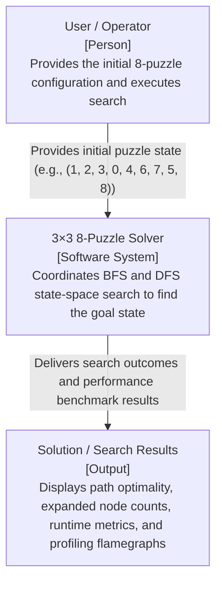

## C4 Level 1: Context Diagram

### Context Diagram Explanation
* **System Boundary & Scope:** The Level 1 Context Diagram establishes the highest architectural viewpoint of the 3×3 8-Puzzle Solver, defining how the core system boundary interacts with external entities without exposing internal implementation details.
* **User Interaction:** The external User/Operator provides the input state configuration tuple as the search premise and triggers execution. The system operates strictly as an autonomous problem-solving agent once the problem parameters are ingested.
* **System Responsibilities:** The 3×3 8-Puzzle Solver houses the search orchestration logic, state transformation mechanics, and graph-traversal rules necessary to navigate from start to goal.
* **Output & Deliverables:** The system externalizes structured diagnostic results, including boolean search success, path discovery, expanded node volume, quantitative execution latencies via `timeit`, and CPU stack-sampling flamegraphs via `py-spy` for empirical analysis.
